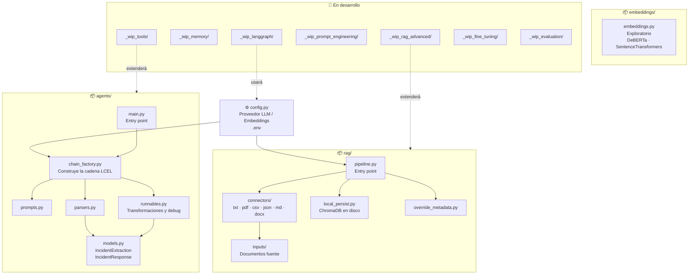
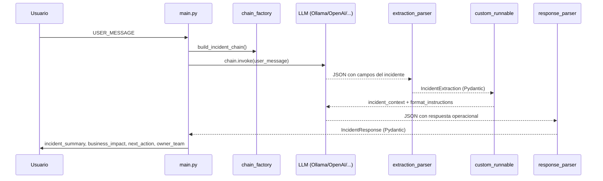
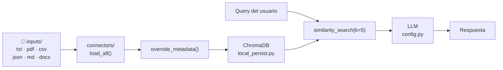

# Arquitectura del proyecto

## Visión general



---

## Flujo del agente LCEL (`agents/`)



---

## Flujo del pipeline RAG (`rag/`)



---

## Configuración por entorno (`.env`)

```mermaid
graph LR
    ENV[".env"]
    ENV -->|LLM_PROVIDER| CFG["config.py"]
    ENV -->|LLM_MODEL| CFG
    ENV -->|LLM_TEMPERATURE| CFG
    ENV -->|EMBEDDING_PROVIDER| CFG
    ENV -->|EMBEDDING_MODEL| CFG
    CFG -->|get_llm()| AGENTS["agents/"]
    CFG -->|get_llm() + get_embeddings()| RAG["rag/"]
```

---

## Estructura de carpetas

```
temas_ia/
├── config.py                  # Configuración central de LLM y embeddings
├── pyproject.toml             # Paquete instalable (uv / pip install -e .)
│
├── agents/                    # Agente LCEL de análisis de incidentes
│   ├── __init__.py
│   ├── main.py                # Entry point  →  python -m agents.main
│   ├── models.py              # Pydantic: IncidentExtraction, IncidentResponse
│   ├── prompts.py             # ChatPromptTemplates
│   ├── parsers.py             # PydanticOutputParsers
│   ├── runnables.py           # Transformaciones y pasos de debug
│   └── chain_factory.py      # Ensambla la cadena LCEL completa
│
├── rag/                       # Pipeline RAG con ChromaDB
│   ├── __init__.py
│   ├── pipeline.py            # Entry point  →  python -m rag.pipeline
│   ├── local_persist.py       # Carga / crea vectorstore en disco
│   ├── override_metadata.py   # Etiquetado manual de documentos
│   ├── connectors/            # Un conector por formato (txt, pdf, csv...)
│   └── inputs/                # Documentos fuente organizados por formato
│
├── embeddings/
│   └── embeddings.py          # Exploratorio: DeBERTa + SentenceTransformers
│
└── _wip_*/                    # Notas y temario de temas en preparación
    ├── _wip_langgraph/        # Grafos de estado, ReAct, memoria, HITL
    ├── _wip_tools/            # Tool binding y agentes con herramientas
    ├── _wip_rag_advanced/     # RAG avanzado (reranking, HyDE, etc.)
    ├── _wip_memory/           # Memoria conversacional
    ├── _wip_prompt_engineering/
    ├── _wip_fine_tuning/
    └── _wip_evaluation/
```
